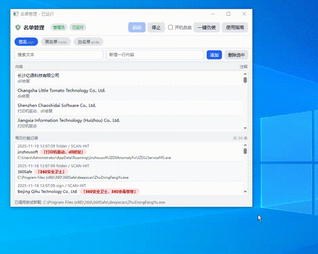
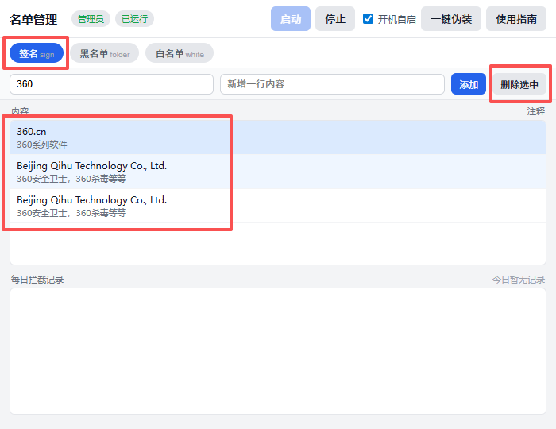

# 禁止广告运行
#### folder.txt
>目录黑名单：在该名单内的目录运行的程序将会结束
#### sign.txt
>签名黑名单：在该名单内的签名程序将会结束
#### whitelist.txt
>目录白名单:在该名单内的目录运行的程序将会跳过
#### note.txt
>注释文本：该文件为folder.txt、sign.txt、whitelist.txt提供注释
#### fake目录
>用于伪装技术人员
#### block-ads-ui目录
>基于webview2的ui
#### tools目录
>打包用的工具
#### block-ads.exe
>拦截核心程序,直接双击运行同样可以实现拦截
#### UI.exe
>为各种名单和核心程序提供可视化界面
#### Code.exe
>运行后将为伪装成vscode进程，并且窗口类名为"CabinetWClass",标题为"控制面板"

# 效果

# 卸载软件

# 定位软件
>#### 双击下方拦截记录的列表项目

# 使用说明
>#### 需要webview2运行时
>#### 打开桌面的"禁止广告"快捷方式，点击"一键伪装"，然后点击"启动"
>#### 如果有安全软件报毒，请加入信任名单
>#### 仅支持win10以上系统
>#### 运行了之后将无法安装/运行特定软件，如果需要运行，请在"禁止广告"快捷方式中点击"停止"，然后修改黑名单
>>##### 例如我运行了个软件，无法安装360安全卫士了，我应该打开"禁止广告"软件，点击"停止"，然后在黑名单和签名中中去除360系列

# 一键伪装
>#### 1.伪装虚拟机
>将会设置HKEY_CLASSES_ROOT\Applications\VMwareHostOpen.exe\shell\open\command的默认值
>#### 2.伪装vip
>设置%APPDATA%\TabXExplorer\config.ini 文件中 settings 节的 level 值
>#### 3.伪装360弹窗过滤模式
>设置HKEY_LOCAL_MACHINE\SOFTWARE\WOW6432Node\360Safe\stat项中 noadpop 与 advtool_PopWndTracker 的键值
>#### 4.伪装禁止投放广告人群
>将会调用默认浏览器访问一次知乎"zhihu.com"
>#### 5.伪装安装火绒
>将会在HKEY_LOCAL_MACHINE\SOFTWARE\Microsoft\Windows\CurrentVersion\Uninstall新增一个火绒的安装项和"DisplayIcon"键
>#### 6.伪装技术人员
>将会在后台运行一个空壳程序"Code.exe"(vscode),其中窗口类名为"CabinetWClass",标题为"控制面板"

# 不安装webview2runtime
> #### 直接执行"block-ads.exe"同样可以实现拦截

# 浏览器解决广告（推荐）
#### 不建议使用360/2345等浏览器
>#### 第一步浏览器下载安装油猴
>[油猴官网](https://www.tampermonkey.net/index.php)
>[油猴crx下载（适用于谷歌等特殊浏览器）](https://bluered.lanzouo.com/i1jfd3b90kfe)
>[本地crx插件安装教程]("https://blog.csdn.net/chouchoubuchou/article/details/146294436")

>#### 第二步安装这个脚本即可实现浏览器去广告
>[AC-baidu-重定向优化百度搜狗谷歌必应搜索](https://openuserjs.org/scripts/inDarkness/AC-baidu-%E9%87%8D%E5%AE%9A%E5%90%91%E4%BC%98%E5%8C%96%E7%99%BE%E5%BA%A6%E6%90%9C%E7%8B%97%E8%B0%B7%E6%AD%8C%E5%BF%85%E5%BA%94%E6%90%9C%E7%B4%A2_favicon_%E5%8F%8C%E5%88%97)

# 运行时
>[webview2](https://developer.microsoft.com/zh-cn/microsoft-edge/webview2)

# 库
>github.com/bi-zone/etw
>golang.org/x/sys/windows
>github.com/webview/webview_go
>golang.org/x/sys/windows/registry

# 编译
>go build -ldflags="-H=windowsgui -s -w" -trimpath

# 致谢
[SoftCnKiller](https://github.com/SiHaiYiYeQiu/SoftCnKiller)